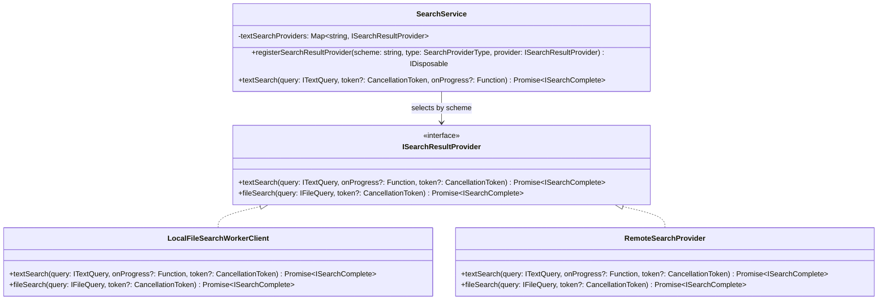
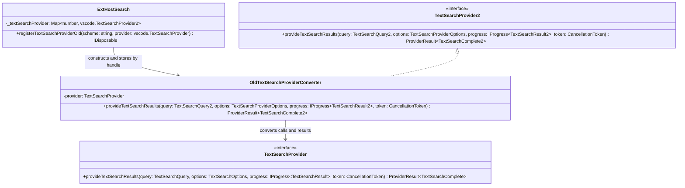
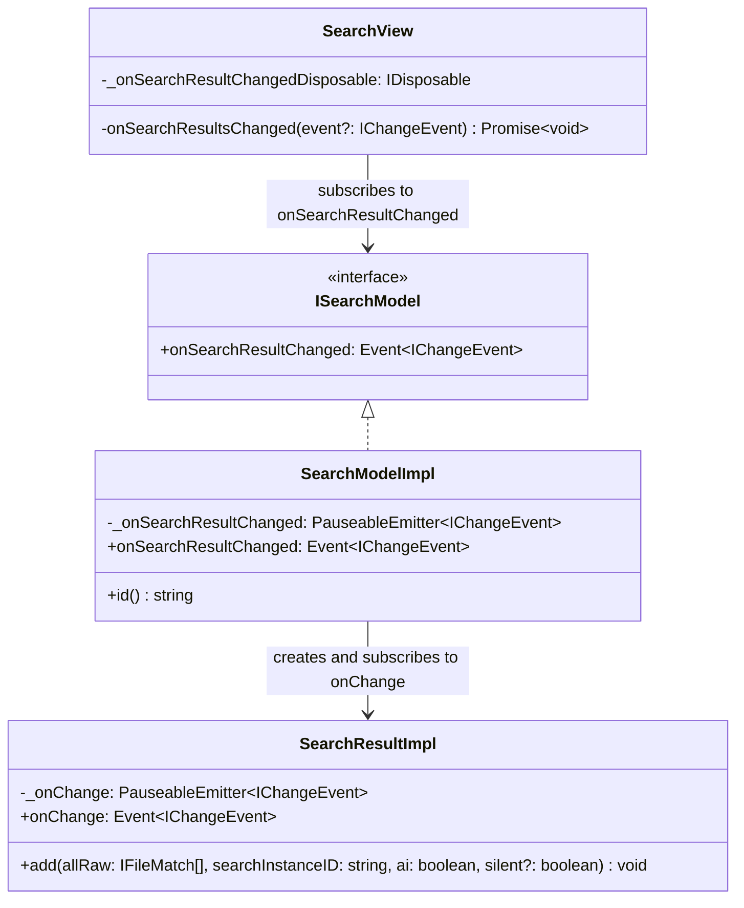
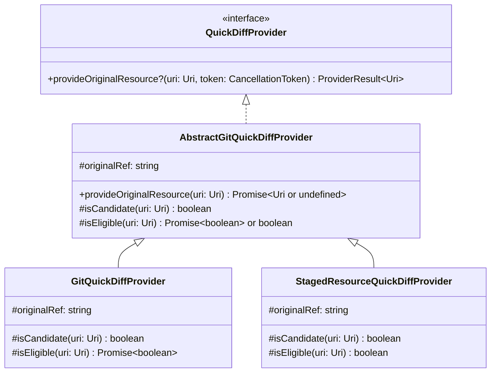

# Design Patterns

Project: Visual Studio Code fork. The three existing patterns below are identified in the code as it stood before this assignment. The new pattern and the GRASP change are separate edits. Links to new or modified files on the fork's `main` branch will resolve to this version after the separate commits are pushed; this draft was checked against the local working tree.

## 1. Three GoF patterns already in the project

### Strategy: search providers selected by resource scheme

**Roles.** `SearchService` is the context and selects a registered provider for the query type and URI scheme. `ISearchResultProvider` is the strategy interface. `LocalFileSearchWorkerClient` handles file-scheme searches through a browser worker; `RemoteSearchProvider` forwards extension-provided searches to the extension host. The latter is a module-local class in `mainThreadSearch.ts`.



Diagram source: [`docs/design-patterns-strategy.mmd`](https://github.com/bolanosmanny/vscode/blob/main/docs/design-patterns-strategy.mmd). The source diagram also includes registration and cache method signatures.

In this diagram, `Function` abbreviates the actual `(item: ISearchProgressItem) => void` callback type.

```typescript
// SearchService.searchWithProviders: provider selection
let provider = this.getSearchProvider(query.type).get(scheme);
```

After handling an unregistered provider and building `oneSchemeQuery`, the same method dispatches through the interface:

```typescript
const doProviderSearch = () => {
    switch (query.type) {
        case QueryType.File:
            return provider.fileSearch(<IFileQuery>oneSchemeQuery, token);
        case QueryType.Text:
            return provider.textSearch(<ITextQuery>oneSchemeQuery, onProviderProgress, token);
        default:
            return provider.textSearch(<ITextQuery>oneSchemeQuery, onProviderProgress, token);
    }
};
```

**Why it matters here.** Search works over local files and extension-supplied schemes. The service can route a query to either implementation using the same `textSearch`/`fileSearch` contract. Without this boundary, `SearchService` would need direct knowledge of web workers, extension host RPC, and every future search backend. See [`searchService.ts`](https://github.com/bolanosmanny/vscode/blob/main/src/vs/workbench/services/search/common/searchService.ts), [`search.ts`](https://github.com/bolanosmanny/vscode/blob/main/src/vs/workbench/services/search/common/search.ts), [`browser/searchService.ts`](https://github.com/bolanosmanny/vscode/blob/main/src/vs/workbench/services/search/browser/searchService.ts), and [`mainThreadSearch.ts`](https://github.com/bolanosmanny/vscode/blob/main/src/vs/workbench/api/browser/mainThreadSearch.ts).

### Adapter: old text search providers used through the new API

**Roles.** `ExtHostSearch` is the client and stores values typed as `vscode.TextSearchProvider2`. `OldTextSearchProviderConverter` is the adapter: it implements the internal `TextSearchProvider2` interface in `searchExtTypes.ts`, and `ExtHostSearch` puts an instance in that map. Its wrapped provider uses the internal legacy `TextSearchProvider` interface in `searchExtConversionTypes.ts`; the registration parameter is typed as `vscode.TextSearchProvider`. The API and internal declarations are separate types; TypeScript accepts the adapter at this assignment.



Diagram source: [`docs/design-patterns-adapter.mmd`](https://github.com/bolanosmanny/vscode/blob/main/docs/design-patterns-adapter.mmd). The proposed extension API declarations are in [`vscode.proposed.textSearchProvider.d.ts`](https://github.com/bolanosmanny/vscode/blob/main/src/vscode-dts/vscode.proposed.textSearchProvider.d.ts) and [`vscode.proposed.textSearchProvider2.d.ts`](https://github.com/bolanosmanny/vscode/blob/main/src/vscode-dts/vscode.proposed.textSearchProvider2.d.ts).

```typescript
// ExtHostSearch.registerTextSearchProviderOld, abridged
this._textSearchProvider.set(handle, new OldTextSearchProviderConverter(provider));

// OldTextSearchProviderConverter.provideTextSearchResults, abridged
const progressShim = (oldResult: TextSearchResult) => {
    if (!validateProviderResult(oldResult)) {
        return;
    }
    progress.report(oldToNewTextSearchResult(oldResult));
};
const getResult = async () => {
    return coalesce(await Promise.all(
        newToOldTextProviderOptions(options).map(
            o => this.provider.provideTextSearchResults(query, o, { report: (e) => progressShim(e) }, token))))
        .reduce(
            (prev, cur) => ({ limitHit: prev.limitHit || cur.limitHit }),
            { limitHit: false }
        );
};
```

**Why it matters here.** `ExtHostSearch.registerTextSearchProviderOld` accepts providers written for the older text search API, while its provider map uses the newer API type. The converter changes options and streamed results at that boundary. Without it, that registration method could not put a legacy provider into the newer provider path as it does today. See [`extHostSearch.ts`](https://github.com/bolanosmanny/vscode/blob/main/src/vs/workbench/api/common/extHostSearch.ts), [`searchExtConversionTypes.ts`](https://github.com/bolanosmanny/vscode/blob/main/src/vs/workbench/services/search/common/searchExtConversionTypes.ts), and [`searchExtTypes.ts`](https://github.com/bolanosmanny/vscode/blob/main/src/vs/workbench/services/search/common/searchExtTypes.ts).

### Observer: search results notify the model and view

**Roles.** `SearchResultImpl` is the first subject, exposing `onChange`; `SearchModelImpl` observes it and republishes changes through `onSearchResultChanged`. `SearchView` observes the model and updates the results UI. The events use `PauseableEmitter<IChangeEvent>` so batches can be merged.



Diagram source: [`docs/design-patterns-observer.mmd`](https://github.com/bolanosmanny/vscode/blob/main/docs/design-patterns-observer.mmd).

```typescript
// SearchModelImpl constructor
this._register(this._searchResult.onChange((e) => this._onSearchResultChanged.fire(e)));

// SearchView
this._onSearchResultChangedDisposable = this._register(this.viewModel.onSearchResultChanged(async (event) => await this.onSearchResultsChanged(event)));
```

**Why it matters here.** File matches arrive over time, and replacing or removing matches also changes the tree. The model can publish those changes without knowing which Search view is displaying it. Without the event chain, result mutation code would have to call UI refresh methods directly and account for views being recreated or disposed. See [`searchResult.ts`](https://github.com/bolanosmanny/vscode/blob/main/src/vs/workbench/contrib/search/browser/searchTreeModel/searchResult.ts), [`searchModel.ts`](https://github.com/bolanosmanny/vscode/blob/main/src/vs/workbench/contrib/search/browser/searchTreeModel/searchModel.ts), and [`searchView.ts`](https://github.com/bolanosmanny/vscode/blob/main/src/vs/workbench/contrib/search/browser/searchView.ts).

## 2. Missing pattern: Template Method in Git quick diff

Before this change, `GitQuickDiffProvider` and `StagedResourceQuickDiffProvider` each implemented `provideOriginalResource` from start to finish. Both checked the file URI scheme, rejected symbolic links, created a `.git` URI, and logged the result. The checks lived in two copies of the algorithm, so a new shared exclusion or a change to URI creation had to be made twice. The providers also have necessary differences: the working-tree provider uses the empty Git ref (which `git show :path` reads from the index), while the staged provider uses `HEAD`; their eligibility rules differ. The empty-ref behavior is visible in [`git.ts`](https://github.com/bolanosmanny/vscode/blob/main/extensions/git/src/git.ts) and [`fileSystemProvider.ts`](https://github.com/bolanosmanny/vscode/blob/main/extensions/git/src/fileSystemProvider.ts).

Template Method supplies a common `provideOriginalResource` sequence and leaves the varying steps in protected hooks. This restores **GRASP High Cohesion**: the common workflow has one owner, while each concrete provider owns its Git-specific eligibility and reference choice. It also reduces the risk of inconsistent behavior when the common quick diff workflow changes.

## 3. Pattern implementation: before and after

**Before (selected lines from the two separate methods in the [pre-refactor commit `7db63763f51`](https://github.com/bolanosmanny/vscode/blob/7db63763f51/extensions/git/src/quickDiffProvider.ts)):**

```typescript
// GitQuickDiffProvider
if (uri.scheme !== 'file') {
    this.logger.trace(`[Repository][provideOriginalResource] Resource is not a file: ${uri.scheme}`);
    return undefined;
}
const stat = await workspace.fs.stat(uri);
const originalResource = toGitUri(uri, '', { replaceFileExtension: true });

// StagedResourceQuickDiffProvider
if (uri.scheme !== 'file') {
    this.logger.trace(`[StagedResourceQuickDiffProvider][provideOriginalResource] Resource is not a file: ${uri.scheme}`);
    return undefined;
}
const stat = await workspace.fs.stat(uri);
const originalResource = toGitUri(uri, 'HEAD', { replaceFileExtension: true });
```

**After (the shared method in `AbstractGitQuickDiffProvider`):**

```typescript
async provideOriginalResource(uri: Uri): Promise<Uri | undefined> {
    this.trace(`Resource: ${uri.toString()}`);

    if (uri.scheme !== 'file') {
        this.trace(`Resource is not a file: ${uri.scheme}`);
        return undefined;
    }

    if (!this.isCandidate(uri)) {
        return undefined;
    }

    const stat = await workspace.fs.stat(uri);
    if ((stat.type & FileType.SymbolicLink) !== 0) {
        this.trace(`Resource is a symbolic link: ${uri.toString()}`);
        return undefined;
    }

    if (!await this.isEligible(uri)) {
        return undefined;
    }

    const originalResource = toGitUri(uri, this.originalRef, { replaceFileExtension: true });
    this.trace(`Original resource: ${originalResource.toString()}`);
    return originalResource;
}
```

The protected `isCandidate`, `isEligible`, and `originalRef` hooks are implemented separately by each provider in [`quickDiffProvider.ts`](https://github.com/bolanosmanny/vscode/blob/main/extensions/git/src/quickDiffProvider.ts). The implementation preserves each provider's check order and trace prefix. A shared check or URI conversion now changes once; another quick diff variant can supply its own eligibility and reference hooks.



Diagram source: [`docs/design-patterns-template-method.mmd`](https://github.com/bolanosmanny/vscode/blob/main/docs/design-patterns-template-method.mmd).

**Planned separate commit:** `A8: Apply Template Method to GitQuickDiffProvider` (not committed in this draft).

## 4. Separate GRASP refactoring: Information Expert

Previously, `SearchView` traversed `ISCMService.repositories`, provider groups, and resources to decide whether changed files exist and to collect their URIs for a changed-files search. `SCMService` now exposes `hasChangedFiles(): boolean` and `getChangedFileUris(): URI[]`; `SearchView` calls those methods. SCM owns the data and the calculation, so Search no longer knows the provider-group-resource layout for this feature. This applies **GRASP Information Expert** and reduces the Search-to-SCM data coupling identified in the earlier architecture page.

```typescript
// Before, in SearchView
changedFileUris = [...this.scmService.repositories]
    .flatMap(repository => repository.provider.groups)
    .flatMap(group => group.resources)
    .map(resource => resource.sourceUri);

// After, in SearchView
const changedFileUris = onlySearchInChangedFiles ? this.scmService.getChangedFileUris() : undefined;
```

The implementation is in [`scm.ts`](https://github.com/bolanosmanny/vscode/blob/main/src/vs/workbench/contrib/scm/common/scm.ts), [`scmService.ts`](https://github.com/bolanosmanny/vscode/blob/main/src/vs/workbench/contrib/scm/common/scmService.ts), and [`searchView.ts`](https://github.com/bolanosmanny/vscode/blob/main/src/vs/workbench/contrib/search/browser/searchView.ts).

**Planned separate commit:** `A8-GRASP: Refactor SearchView to apply Information Expert` (not committed in this draft).

## 5. GoF and GRASP

GRASP helps decide which class should hold a responsibility; GoF patterns provide reusable structures for common design problems. In Git quick diff, High Cohesion points to one owner for the shared URI checking and conversion workflow, and Template Method gives that owner a concrete design while each provider keeps its own Git-specific rules. In the separate Search change, Information Expert puts changed-file calculations in `SCMService`; no GoF pattern is needed for that small responsibility move.

