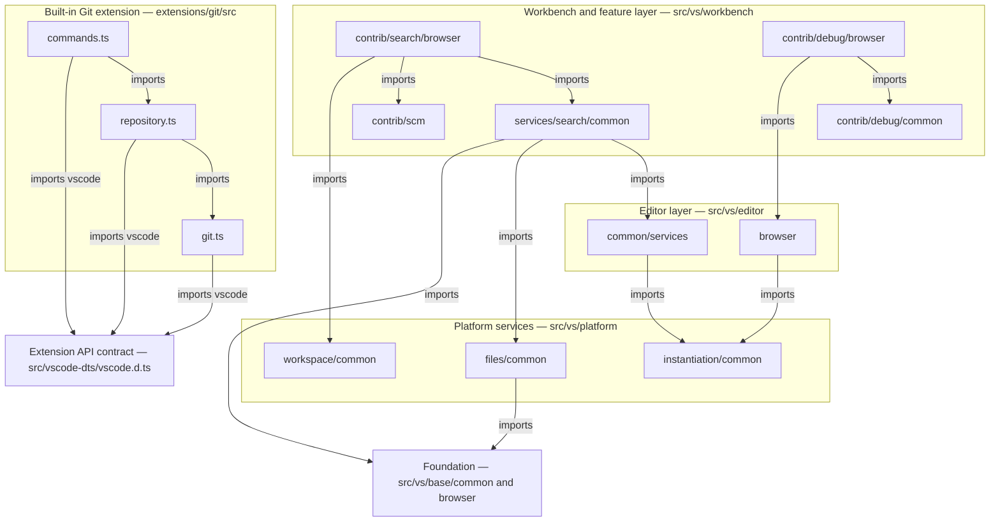
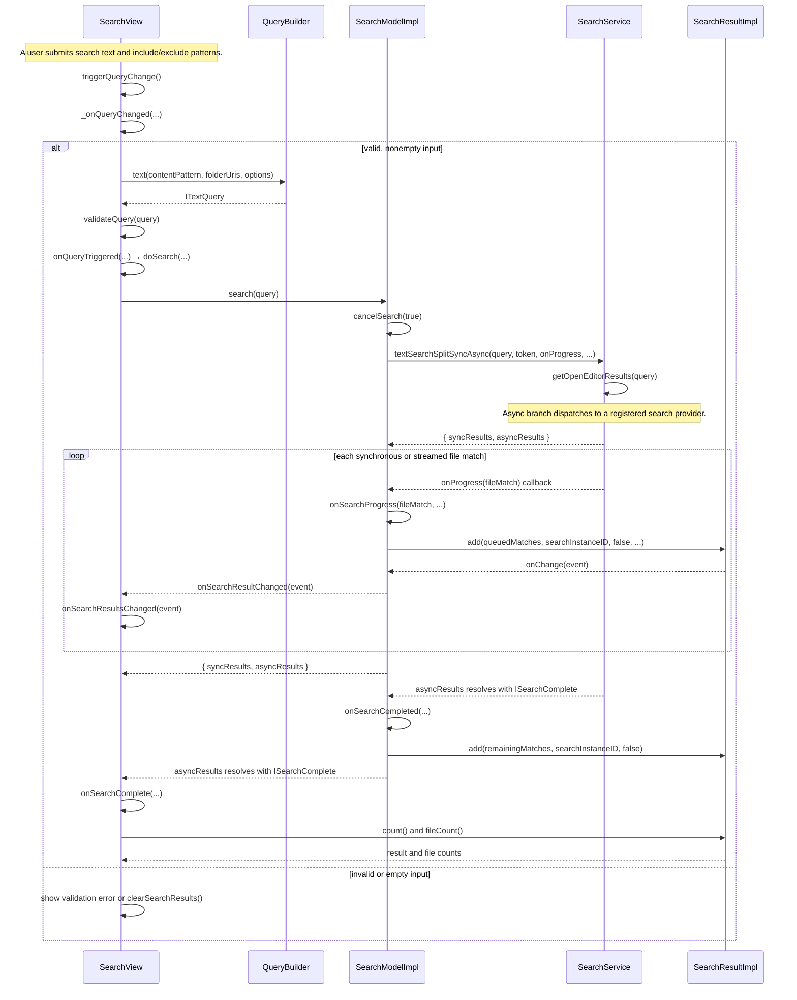
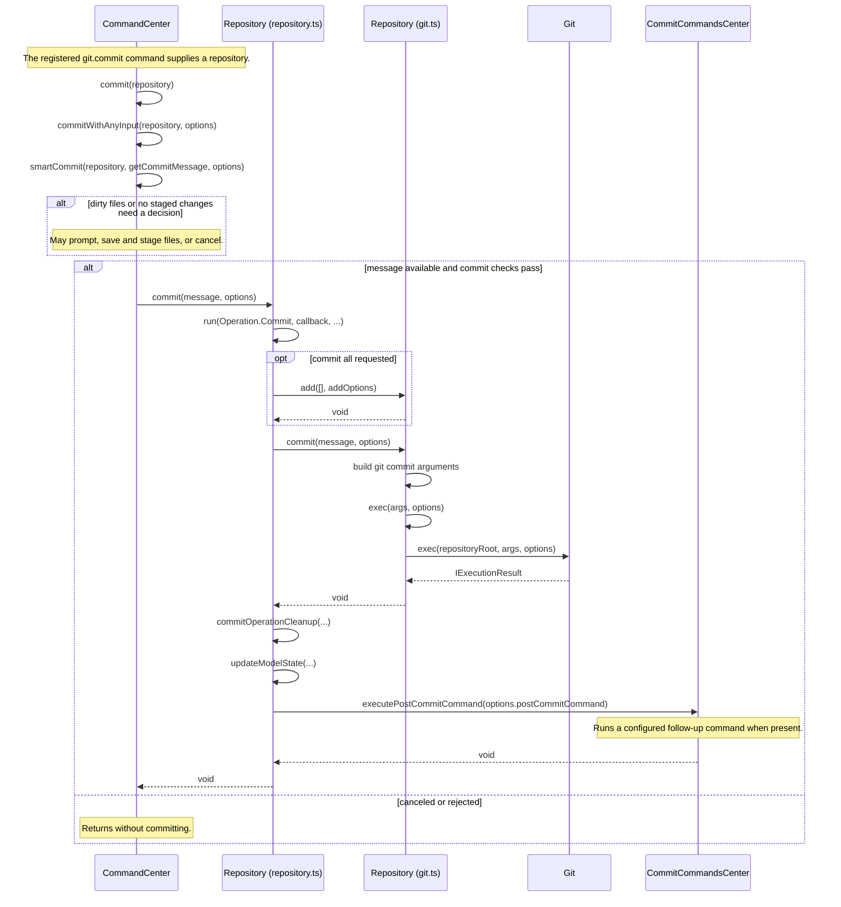

# Logical Architecture

**Project:** Visual Studio Code  
**Course:** CSCI 360, Fall 2026  
**Editable diagram sources:** [architecture](https://github.com/bolanosmanny/vscode/blob/main/docs/logical-architecture.mmd), [workspace search](https://github.com/bolanosmanny/vscode/blob/main/docs/search-workspace-interaction.mmd), [Git commit](https://github.com/bolanosmanny/vscode/blob/main/docs/commit-source-changes-interaction.mmd). These links resolve after the files are committed to `main`.

## 1. Architectural style

VS Code is a **hybrid of layered and extension based architecture**. The main source tree separates foundation code in `src/vs/base`, services and dependency injection in `src/vs/platform`, editor code in `src/vs/editor`, and user facing features and services in `src/vs/workbench`; for example, [`searchView.ts`](https://github.com/bolanosmanny/vscode/blob/main/src/vs/workbench/contrib/search/browser/searchView.ts#L72) imports the workbench search service, editor modules, platform services, and base utilities, while [`searchService.ts`](https://github.com/bolanosmanny/vscode/blob/main/src/vs/workbench/services/search/common/searchService.ts#L17) imports editor, platform, and base modules, and [`fileService.ts`](https://github.com/bolanosmanny/vscode/blob/main/src/vs/platform/files/common/fileService.ts#L6) imports base utilities. The built-in `extensions/git/src` subtree is an extension: [`commands.ts`](https://github.com/bolanosmanny/vscode/blob/main/extensions/git/src/commands.ts#L8) imports the `vscode` API and its own `repository.ts`, which imports the lower-level `git.ts` wrapper. This is not a strict textbook stack: the Search view also imports and traverses the sibling SCM feature, as documented below.

## 2. Logical architecture

Arrows mean a **source dependency/import**. They show selected representative imports, not every module in the repository. The Git extension reaches the host through the `vscode` API contract rather than importing workbench internals.



The Search-to-SCM arrow is the cross-feature dependency discussed in section 4. The Git arrows are confirmed by the imports in [`commands.ts`](https://github.com/bolanosmanny/vscode/blob/main/extensions/git/src/commands.ts#L8), [`repository.ts`](https://github.com/bolanosmanny/vscode/blob/main/extensions/git/src/repository.ts#L14), and [`git.ts`](https://github.com/bolanosmanny/vscode/blob/main/extensions/git/src/git.ts#L15). The editor and platform arrows are visible in [`codeEditorWidget.ts`](https://github.com/bolanosmanny/vscode/blob/main/src/vs/editor/browser/widget/codeEditor/codeEditorWidget.ts#L55), [`modelService.ts`](https://github.com/bolanosmanny/vscode/blob/main/src/vs/editor/common/services/modelService.ts#L13), and [`fileService.ts`](https://github.com/bolanosmanny/vscode/blob/main/src/vs/platform/files/common/fileService.ts#L6).

## 3. Object interaction diagrams

### A. Search Workspace — expansion of the prior SSD event

This expands `searchWorkspace(textPattern, includePattern, excludePattern)` from the [earlier SSD](https://github.com/bolanosmanny/vscode/blob/main/docs/search-workspace-ssd.mmd). That SSD names the user-level operation; the actual code builds an `ITextQuery` and calls `SearchModelImpl.search`. Every lifeline below names a class defined in the repository: [`SearchView`](https://github.com/bolanosmanny/vscode/blob/main/src/vs/workbench/contrib/search/browser/searchView.ts#L128), [`QueryBuilder`](https://github.com/bolanosmanny/vscode/blob/main/src/vs/workbench/services/search/common/queryBuilder.ts), [`SearchModelImpl`](https://github.com/bolanosmanny/vscode/blob/main/src/vs/workbench/contrib/search/browser/searchTreeModel/searchModel.ts#L25), [`SearchService`](https://github.com/bolanosmanny/vscode/blob/main/src/vs/workbench/services/search/common/searchService.ts#L28), and [`SearchResultImpl`](https://github.com/bolanosmanny/vscode/blob/main/src/vs/workbench/contrib/search/browser/searchTreeModel/searchResult.ts#L22). Synchronous matches can trigger callbacks before `textSearchSplitSyncAsync` returns; the loop groups those callbacks with later streamed matches to keep the diagram readable.



The path is visible in [`searchView.ts` query construction and dispatch](https://github.com/bolanosmanny/vscode/blob/main/src/vs/workbench/contrib/search/browser/searchView.ts#L1610), [`SearchModelImpl.search`](https://github.com/bolanosmanny/vscode/blob/main/src/vs/workbench/contrib/search/browser/searchTreeModel/searchModel.ts#L215), [`SearchService.textSearchSplitSyncAsync`](https://github.com/bolanosmanny/vscode/blob/main/src/vs/workbench/services/search/common/searchService.ts#L118), and [`SearchResultImpl.add`](https://github.com/bolanosmanny/vscode/blob/main/src/vs/workbench/contrib/search/browser/searchTreeModel/searchResult.ts#L201).

### B. Commit Source Changes — `git.commit`

This traces the normal staged-commit path after the user submits the commit command. The two `Repository` lifelines are different real classes: [`Repository` in `repository.ts`](https://github.com/bolanosmanny/vscode/blob/main/extensions/git/src/repository.ts#L712) manages extension state, while [`Repository` in `git.ts`](https://github.com/bolanosmanny/vscode/blob/main/extensions/git/src/git.ts#L1357) builds Git commands; [`Git`](https://github.com/bolanosmanny/vscode/blob/main/extensions/git/src/git.ts#L387) executes them. [`CommandCenter`](https://github.com/bolanosmanny/vscode/blob/main/extensions/git/src/commands.ts#L782) is the command entry point, and [`CommitCommandsCenter`](https://github.com/bolanosmanny/vscode/blob/main/extensions/git/src/postCommitCommands.ts#L76) handles the optional follow-up action. The earlier SSD shows `commitId` as an abstract success response, but these implementation methods return `Promise<void>`; no `commitId` return is drawn.



The calls are in [`CommandCenter.commit` and `smartCommit`](https://github.com/bolanosmanny/vscode/blob/main/extensions/git/src/commands.ts#L2374), [`Repository.commit` and `run`](https://github.com/bolanosmanny/vscode/blob/main/extensions/git/src/repository.ts#L1436), and [`Repository.commit` and `Git.exec`](https://github.com/bolanosmanny/vscode/blob/main/extensions/git/src/git.ts#L2071). The optional `add` branch represents `opts.all`, which is absent for an ordinary staged-only commit.

## 4. Architectural concern

The Search view directly imports the SCM service and traverses its repository, group, and resource structure to assemble the “changed files” search scope ([`searchView.ts`, import and call](https://github.com/bolanosmanny/vscode/blob/main/src/vs/workbench/contrib/search/browser/searchView.ts#L77), [query code](https://github.com/bolanosmanny/vscode/blob/main/src/vs/workbench/contrib/search/browser/searchView.ts#L1654)):

```typescript
changedFileUris = [...this.scmService.repositories]
    .flatMap(repository => repository.provider.groups)
    .flatMap(group => group.resources)
    .map(resource => resource.sourceUri);
```

This couples search UI code to the internal shape of another feature. A change in how SCM groups resources can require a Search view change, and search-query tests must account for SCM repository state even when testing search behavior.

## 5. GRASP findings

### Applied well: Information Expert — `SearchResultImpl.count`

[`SearchResultImpl`](https://github.com/bolanosmanny/vscode/blob/main/src/vs/workbench/contrib/search/browser/searchTreeModel/searchResult.ts#L241) owns the plain and AI result headings, so it has the information needed to compute the displayed total. `SearchView` asks it for the count instead of keeping a separate tally that could drift as results stream or clear.

```typescript
count(ignoreSemanticSearchResults: boolean = false): number {
    if (ignoreSemanticSearchResults) {
        return this._plainTextSearchResult.count();
    }
    return this._plainTextSearchResult.count() + this._aiTextSearchResult.count();
}
```

### Applied well: Indirection — Git extension `Repository.commit`

The [`Repository` in `extensions/git/src/repository.ts`](https://github.com/bolanosmanny/vscode/blob/main/extensions/git/src/repository.ts#L1436) sits between `CommandCenter` and the lower-level [`Repository` in `git.ts`](https://github.com/bolanosmanny/vscode/blob/main/extensions/git/src/git.ts#L2071). It handles operation state and cleanup while delegating the actual Git command, so the command handler need not construct process arguments or refresh repository state itself.

```typescript
await this.repository.commit(message, opts);
await this.commitOperationCleanup(message, indexResources, workingGroupResources);
```

### Violated: Low Coupling — `SearchView._onQueryChanged`

[`SearchView`](https://github.com/bolanosmanny/vscode/blob/main/src/vs/workbench/contrib/search/browser/searchView.ts#L1654) reaches through `ISCMService` to SCM provider groups and resources while building a search query. That direct knowledge ties a search controller to SCM’s data layout, increasing the number of modules and test fixtures affected by SCM changes.

```typescript
changedFileUris = [...this.scmService.repositories]
    .flatMap(repository => repository.provider.groups)
    .flatMap(group => group.resources)
    .map(resource => resource.sourceUri);
```

## 6. Ninety-second class walkthrough

Open this page before class. **0–25 seconds:** show the architecture diagram and say, “VS Code uses layered core code plus a built-in extension model; the workbench imports editor, platform, and base code.” **25–60 seconds:** show the Search Workspace interaction diagram; explain that the previous SSD’s one system call becomes `SearchView` → `QueryBuilder` → `SearchModelImpl` → `SearchService`, with results fed back through `SearchResultImpl`. **60–90 seconds:** point to the Search-to-SCM arrow and the code in section 4; explain that Search view traverses SCM resource groups itself, so SCM model changes can force search UI and test changes.
